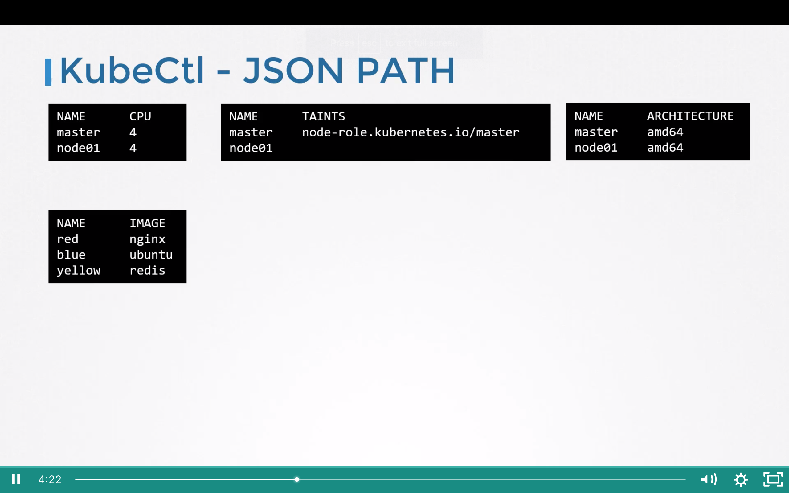
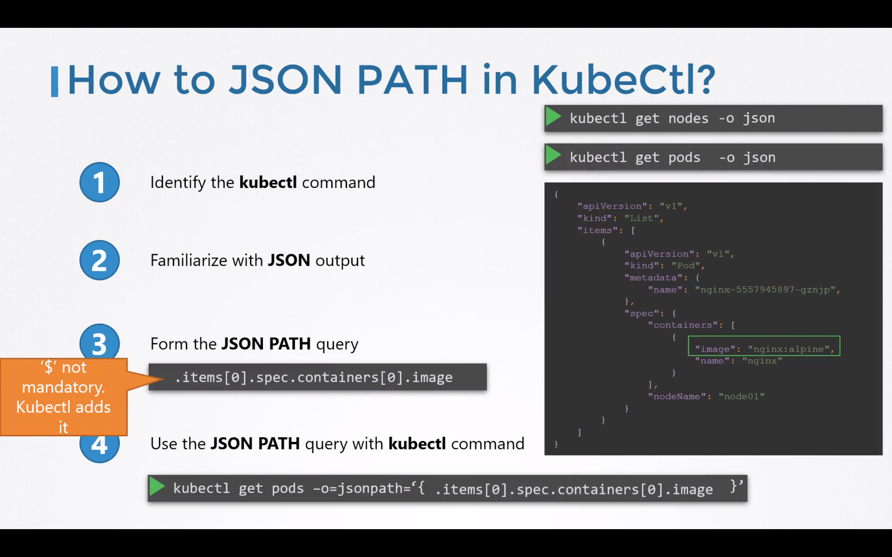
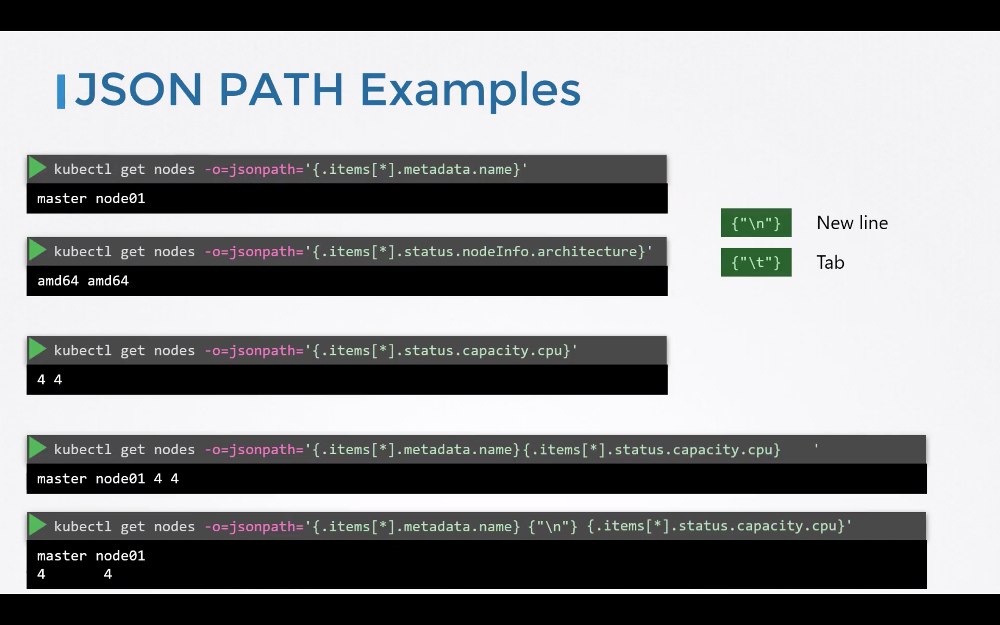
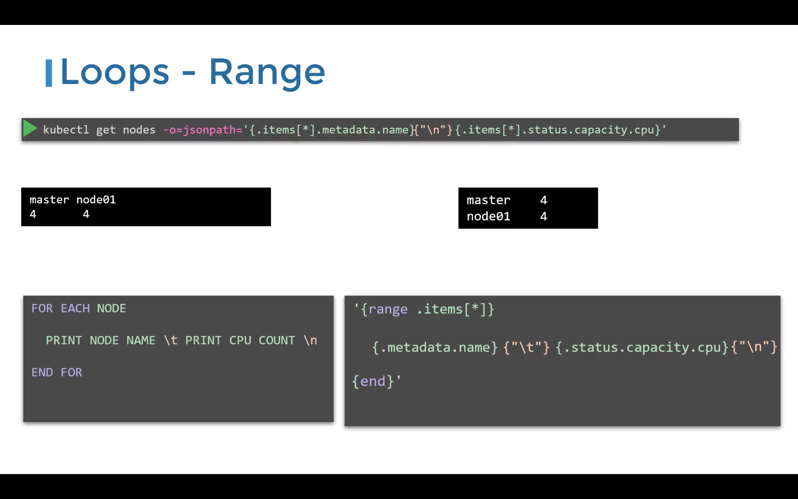
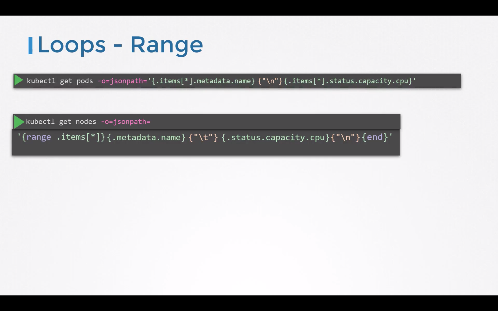
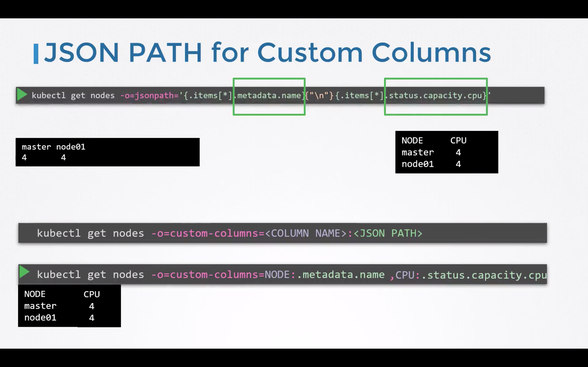
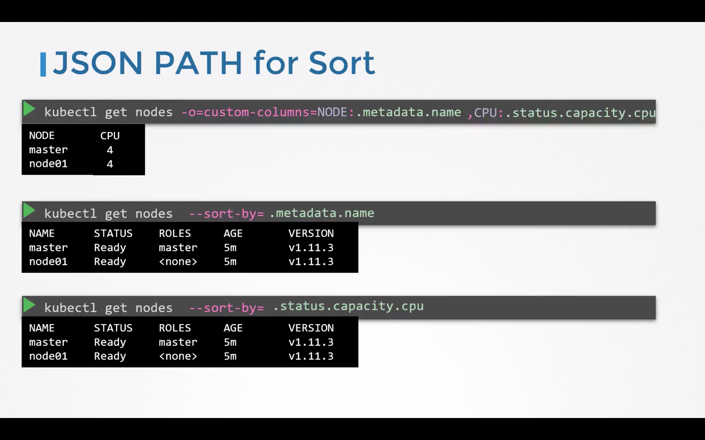

# k8-json-path
- Default output of kubectl command is limited

- You can format and filter output of kubectl command
# How to JSON path in kubectl

# JSON Path example

- Add multiple command
# Loops/Ranges

# JSON Path for custom column

# JSON path for Sort

